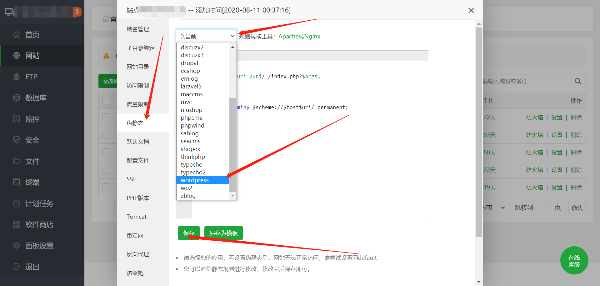
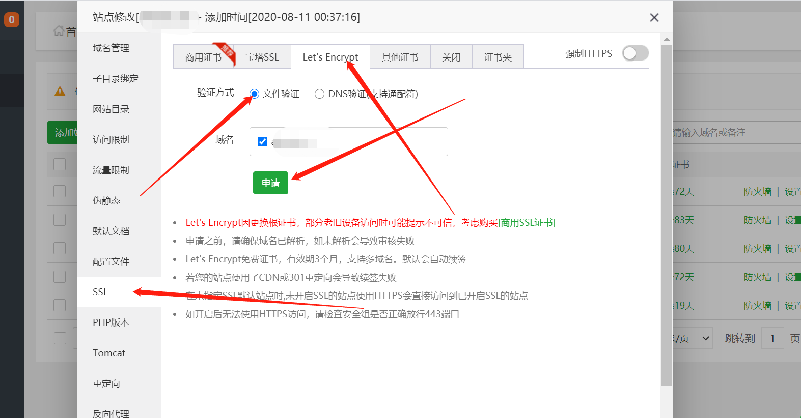

## 开源后台

用的腾讯云系统我们选择centos就可以，选择完了直接去宝塔官网选择宝塔面板安装完以后我们设置网站的伪静态，设置教程如下。

点击左边的网站→点击域名→然后出现如下图的画面，点击设置保存即可

设置完以上，我们设置SSL可以直接用宝塔里面自带也可以用服务商提供的，根据自身情况选择，我们按照宝塔的来操作。

直接点击ssl→选择Let’s Encrypt→选择文件验证→申请等待系统验证3-5分钟验证完成

[转到小店](https://www.tarogoing.uk/shop/)

[返回](../)